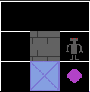

# Sokoban
# Spis treści
* ## [Treść zadania](#treść-zadania)
* ## [Ogólne informacje](#ogc3b3lne-informacje-1)
* ## [Podział projektu](#podziac582-projektu-1)
* ## [Współpraca z bibliotekami](#wspc3b3c582praca-z-bibliotekami-1)
* ## [Realizacja problemu reprezentacji poziomu](#realizacja-problemu-reprezentacji-poziomu-1)
* ## [Testy jednostkowe](#testy-jednostkowe-1)
# Treść zadania
Gra jest rozgrywana na planszy z kwadratów, gdzie każdy kwadrat jest podłogą lub ścianą. Niektóre kwadraty na podłodze zawierają pudełka, a niektóre kwadraty na podłodze są oznaczone jako miejsca do przechowywania.

Gracz jest ograniczony do planszy i może poruszać się poziomo lub pionowo na puste kwadraty (nigdy przez ściany lub pudełka). Gracz może przesunąć skrzynię, podchodząc do niej i przesuwając ją na sąsiedni kwadrat. Pudełek nie można ciągnąć, nie można ich też pchać na kwadraty ze ścianami lub innymi pudełkami. Liczba pudełek równa się liczbie miejsc do przechowywania. Zagadka zostaje rozwiązana, gdy wszystkie pudełka znajdą się w miejscach przechowywania.

Gra powinna oferować kilka poziomów o różnym stopniu trudności. Kolejny poziom odblokowywany jest po ukończeniu poprzedniego. Projekt można zrealizować z wykorzystaniem interfejsu graficznego lub w konsoli. Interfejs powinien umożliwiać restart poziomu.

Jednym z elementów projektu jest wymyślenie sposobu reprezentacji poziomu (np. w pliku), tak aby możliwe było dodawanie w przyszłości kolejnych poziomów. Przykładowe poziomy można znaleźć na stronie: http://www.sokobano.de/en/levels.php


Przykładowa rozgrywka: https://www.youtube.com/watch?v=4mNswr4Zcos
# Ogólne informacje
W skład projektu wchodzą 2 aplikacje
* ### [Gra Sokoban](#gra-sokoban-1)
* ### [Edytor Poziomów](#edytor-poziomc3b3w-1)
## Gra Sokoban
Gra składa się z 15 poziomów o różnym stopniu trudności. Możliwe jest dodawanie nowych poziomów za pomocą edytora poziomów.

Gra jest rozgrywana na planszy z kwadratów o domyślnych wymiarach 20x20 pól(jest to ponadto maksymalna wielkość poziomu obsługiwana przez aplikację, przy rozmiarze tekstury równej 50px). Każde pole jest podłogą lub ścianą. Dodatkowo na niektórych polach ustawone są pudełka, cele lub pudełka z celami. Na planszy znajduje się jeden gracz.

Gracz jest ograniczony do planszy i może poruszać się poziomo lub pionowo na puste kwadraty (nigdy przez ściany lub pudełka). Gracz może przesunąć skrzynię, podchodząc do niej i przesuwając ją na sąsiedni kwadrat. Pudełek nie można ciągnąć, nie można ich też pchać na kwadraty ze ścianami lub innymi pudełkami. Poziom zostaje zaliczony w momencie umieszczenia wszystich pudełek na polach celu.

Z prawej strony znajduje się informacja o grze zawierająca liczbę ruchów wykonanych przez gracza na danym poziomie, liczbę pchnięć pudełka wykonanych przez gracza na danym poziomie oraz przycisk reset, który po kliknięciu na niego lewym przyciskiem myszy umożliwia restart poziomu do stanu początkowego.

Po ukończeniu wszystkich 15 poziomów wyświetlony zostaje stosowny komunikat o ukończeniu gry.

Sterowanie odbywa się za pomocą przycisków:
1. W - w górę
2. S - w dół
3. A - w lewo
4. D - w prawo

## Edytor poziomów
Przy inicjalizacji edytora poziomów należy podać rozmiar poziomu(szerokość, wysokość) oraz ścieżkę do katalogu do którego będą zapisywane stworzone poziomy i z którego mają wczytywane być wcześniej stworzone poziomy. Ponadto opcjonalne są 2 parametry: level - początkowy nr poziomu oraz tile_size - wymiary pojedyńczej tekstury w pikselach.

W edytorze świata plansza podzielona jest na n wierszy oraz m kolumn gdzie n = (wysokość poziomu // wymiary pojedyńczej tekstury) oraz m = (szerokość poziomu // wymiary pojedyńczej tekstury) (obie wartości podawane w pikselach).
Maksymalny wymiar świata to 1000x1000px (20 wierszy x 20 kolumn przy wymiarze jedej tekstury = 50px)

Domyślnie edytor świata jest ustawiony na poziom 1 (zwiększanie i zmiejszanie numeru poziomu odbywa się zapomocą strzałek góra i dół).
Aby załadować poziom, należy wybrać interesujący użytkownika poziom za pomocą strzałek góra i dół, a następnie użyć przycisku LOAD.
W przypadku, gdy plik w formacie **{path}/Level{nr poziomu}_data.json** nie istnieje lub nie może być wczytany użytkownik zostanie poinformowany stosownym komunikatem.

### Tworzenie poziomu

Na planszy podzielonej siatką na kwadraty użytkownik może umieszczać pożądane przez niego obiekty ze zbioru (Pusta przestrzeń, Ściana, Pudełko, Cel, Pudełko z celem, Gracz) za pomocą lewego bądź prawego przycisku myszy. Każde pole ma domyślnie wartość 0. Użycie lewego przycisku myszy spowoduje zwiększenie indekstu pola o 1, natomiast prawego przycisku myszy zmniejszenie indeksu pola o 1. Gdy indeks pola posiada wartość maksymalną i użyty zostanie na nim lewy przycisk myszy wpisana zostanie wartość minimalna - 0. Natomiast w przypadku, gdy pole ma wartość 0 i użyty zostanie prawy przycisk myszy, pole zyskuje wartość maksymalną.

Gdy na planszy nie ma jeszcze gracza, każde pole posiada określony zakres wartości odpowiadających poszczególnym bytom:

0. Pusta przestrzeń
1. Ściana
2. Pudełko
3. Cel
4. Pudełko z celem
5. Gracz

W przypadku gdy gracz zostanie umieszczony na planszy, każde pole posiada określnoy zakres wartości odpowiadających poszczególnym bytom:

0. Pusta przestrzeń
1. Ściana
2. Pudełko
3. Cel
4. Pudełko z celem

Gdy użytkownik uzna, że poziom spełnia wszystkie jego oczekiwania może dokonać jego zapisu do pamięci za pomocą przycisku SAVE. W tym momencie poziom zostanie poddany walidacji i określone zostanie czy spełnia wszystkie wymagania gry(1 gracz na planszy, liczba pudełek odpowiadająca liczbie celów). W przypadku gdy rezulat będzie pomyślny poziom zostanie zapisany do pliku ***{path}/Level{nr poziomu}_data.json***. W przeciwnym razie zapis poziomu się nie odbędzie, a użytkownik zostanie poinformowany o tym fakcie za pomocą stosownego komunikatu.

# Podział projektu
## Moduły główne
* main.py - moduł główny gry Sokoban, z poziomu którego uruchamiany jest gra
* editor.py - moduł główny edytora, z poziomu którego uruchamiany jest edytor poziomów
* settings.py - moduł zawierający ustawienia rozgrywki(wymiary planszy w pikselach, nr pierwszego poziomu, nr ostatniego poziomu, słownik tekstur)

## Moduły klas
### classes.py
Moduł zawierający główne klasy rozgrywki. Klasą bazową dla wszystkich klas rozgrywki jest klasa Entity dziedzicząca po klasie Sprite z biblioteki pygame.
Główne klasy rozgrywki:
1. Tile(Ściana)
2. Box(Pudełko) - klasa rozbudowana o zmianę tekstury pod wpływem kolizji z celem
3. Target(Cel)
4. Player(Gracz) - klasa rozbudowana o wektor direction określający kierunek ruchu gracza i de facto wartość ruchu oraz atrybuty moves i pushes określające odpowiedni liczbę ruchów wykonanych przez gracza oraz liczbę pchnięć pudełek wykonanych przez gracza.

### game.py
Główny moduł gry zawierajacy klasę Game. Przyjmuje ona parametry:
1. szerokość poziomu w pikselach
2. wyskość poziomu w pikselach
3. nr poziomu początkowego
4. nr poziomu końcowego
5. Opcjonalny parametr określajacy wymiary pojedyńczej tekstury(domyślnie 50px)

W metodzie run() inicjalizowana jest rozgrywka. Załadowany zostaje początkowy poziom, zainicjalizowany zostaje zegar taktujący rozgrywkę oraz zmienne logiczne rozgrywki next_level oraz game_over z domyślnymi wartościami False.
W pętli while wykonywane są następujące po sobie czynności:
1. Taktowanie 1 cyklu rozgrywki
2. Zebranie wszystkich eventów(w tym wejść klawiatury oraz myszy) i sprawdzenie czy gra nie została zamknięta, aby móc bezpiecznie ją zamknąć.
3. Jeżeli zmienna game_over jest równa False wykonywane są czynności związane z aktywną rozgrywką
    1. Z eventów zebranych przez pygame zbierane są dane keyboard_input
    2. Jeśli zmienna _key_clicked jest równa False, na obiekcie Level wywoływana jest metoda run() przyjmująca parametr keyboard_input, jeśli zwrócona zostanie wartość True sprawdzane jest czy gra ma załadować następny poziom czy zakończyć całą rozgrywkę(w zależności od aktualnej i maksymalnej wartości numeru poziomu)
    3. Uaktualniana jest zmienna _key_clicked. Zapobiega to problemowi ciągłego przyciskania jednego klawisza i w następstwie niekontrolowanym ruchom. Gra odświeżana jest z częstotliwością 120Hz. Aby wykonać ruch i zresetować zmienną _key_clicked, przed następnym ruchem należy unieść przycisk na klawiaturze do pozycji domyślnej niewciśniętej). Dzięki temu możliwe jest poruszanie po planszy z dużą dokładnością ruchu.
4. Okno wypełniane jest domyślnym kolorem tła i wyświetlane jest menu informacji.
5. Wyświetlane zostają obiekty na planszy oraz przycisk reset.
6. Jeżeli zmienna game_over jest równa True - wyświetlony zostaje komunikat końcowy o zakończeniu rozgrywki. W przeciwnym razie (gdy game_over jest równe False) odblokowany zostaje przycisk Reset, który po aktywacji lewym przyciskiem myszy przywraca poziom do stanu początkowego.
7. Odświeżone zostaje okno.
8. Jeżeli zmienna next_level jest równa True - do zmiennej level załadowany zostaje nowy obiekt Level(o numerze o 1 większym).

### interface.py
Moduł interfejsu graficznego zawierający klasy:
1. Interface - główna klasa interfejsu graficznego wykorzystująca bibliotekę pygame
2. Button - klasa przycisku wyświetlanego w interfejsie graficznym
3. RGB - klasa koloru wyrażona w formacie RGB

### load_level.py
Moduł zawierajacy klasę LoadLevel zajmującą się operacjami zapisu i odczytu poziomów do i z pliku oraz fukcję check_requirements() zajmującą się sprawdzaniem zgodności ładowanego poziomu. Ponadto zawiera szereg autorskich wyjątków zgłaszanych w przypadku wystąpienia konkretnych błędów w grze.

### level.py
Główna klasa zajmująca się logiką gry. Przy inicjalizacji przyjmuje parametry takie jak:
1. Ilość wierszy na planszy
2. Ilość kolumn na planszy
3. Dane nt. planszy uprzednio pobrane z pliku JSON i przetestowane pod kątem zgodności

Następnie w konstruktorze wywoływana jest metoda setup(), która inicjalizuje odpowiednie obiekty na odpowiednich koordynatach planszy odczytując wartości z danych i dekodując je za pomocą słownika tekstur. Zainicjalizowane w ten sposób obiekty są dodawane do odpowiednich grup obiektów typu Sprite z biblioteki pygame.

Główną metodą klasy jest metoda run() odpowiedzialna za wykonanie jednej tury ruchu w grze. Przyjmuje ona parametr keyboard_input będący słownikiem zmiennych logicznych mapującym 512 wejść z klawiatury zebranych przez metodę pygame.key.get_pressed(). Zwraca ona wartość logiczną oznaczającą czy w bieżącej turze gry udało się ukończyć poziom(wszystkie pudełka znalazły się na polach celu).

Na podstawie tych danych ustalany jest kierunek i zwrot ruchu gracza w bieżącej turze.
Jeżeli wartość ruchu gracza spowoduje wyjście gracza poza planszę pozostałe metody w metodzie run() nie są wywoływane i zwracana jest wartość False.
W przeciwnym wypadku sprawdzane są kolizje pomiędzy obiektami w kierunku horyzontalnym oraz wertykalnym. Następnie sprawdzane są kolizje obiektów pudełek z obiektami celów. Uaktualniana jest wartość zmiennej _completed_targets. Jeżeli wszystkie obiekty pudełek znajdą się na polach obiektów celów, zmienna _completed_targets przyjmie wartość równą liczbie celi. W tym momencie metoda run zwróci wartość True oznaczającą ukończenie poziomu. W przeciwnym wypadku zwrócona zostanie wartość False.

W klasie level udało się zastąpić kolizje oferowane wraz z biblioteką pygame własną implementacją kolizji pomiędzy obiektami. Dzięki temu udało się uzyskać większą separację elementów logiki od elementów interfejsu graficznego użytkownika. Pondato zarówno kolizje horyzontalne, jak i wertykalne realizowane są za pomocą jednej metody przyjmującej jako parametr kierunek kolizji(0-"X"-horyzontalnie, 1-"Y"-vertykalnie). Dzięki temu uniknięto powrórzenia dużego bloku kodu i zastosowano się do zasady DRY.
### level_editor.py
Główny moduł edytora zawierający klasę LevelEditor.

# Współpraca z bibliotekami
Projekt został zrealizowany przy użyciu biblioteki **pygame** w wersji **2.1.2**
W ramach projektu biblioteka pygame wykorzystywana jest do pobierania danych użytkownika z klawiatury i myszy oraz wyświetlania obecnego stanu gry w graficznym interfejsie użytkownika. Ponadto została wykorzystana klasa bazowa *Sprite*, która stanowi bazę dla pochodnej klasy *Entity*. Wszystkie klasy obiektów(*Box*, *Target*, *Player*, *Tile*) dziedziczą po klasie *Entity*.

W celu separacji logiki gry od interfejsu zrezygnowano z korzystania z wbudowanych w pakiet pygame kolizji(wykorzystujących atrybut **rect**). W zamian tego zrealizowano własny model kolizji korzystający z klasy Vector2 z matematycznej części pakietu pygame. Atrybut rect wykorzystywany jest tylko do wyświetlania obiektu w interfejsie graficznym(klasa *Entity* posiada metodę update_visual, która uaktualnia obecną pozycję obiektu na ekranie na bazie obecnego stanu wektora pozycji oraz podawanego jako parametr wymiaru jednej tekstury).

# Realizacja problemu reprezentacji poziomu
Poziom jest reprezentowany w postaci pliku JSON zapisanego w katalogu Levels. Jako klucze zawiera numery wierszy na planszy, natomiast wartościami są kolejne słowniki zawierajace jako klucze numer kolumny. Pod kluczem numeru kolumny znajduje się wartość z przedziału 0-5
reprezentujaca określone byty.


W trakcie gry dane poziomu wczytywane są z pliku JSON do słownika. Następnie po weryfikacji zgodności z aktualną sesją gry przekazywane są do obiektu klasy Level, w której to następuje zdekododwanie wartości za pomocą słownika tekstur z pliku settings.py. W efekcie tego na mapie dodawane są odpowiednie byty na pozycjach wskazanych przez numer wiersza i kolumny.

Słownik tekstur z modułu settings.py
```
textures_id_dict = {
    "empty": 0,
    "tile": 1,
    "box": 2,
    "box_target": 3,
    "box_target_with_box": 4,
    "player": 5
    }

```


Przykładowy poziom wymiaru 3x3 zapisany w formacie JSON
```
{
    "0": {
        "0": 0,
        "1": 0,
        "2": 0
    },
    "1": {
        "0": 0,
        "1": 1,
        "2": 5
    },
    "2": {
        "0": 0,
        "1": 2,
        "2": 3
    }
}
```
Wygląd w grze


# Testy jednostkowe
Główna logika gry realizowana jest w ramach klasy Level, dlatego też większość testów jednostkowych zrealizowanych jest właśnie dla metody run z tej klasy.

Ponadto testowane są operacje zapisu i odczytu poziomu z pliku typu JSON oraz walidacja tych plików.
Elementy związane z graficznym interfejsem użytkownika, których przetestowanie było możliwe także zostały poddane testom.